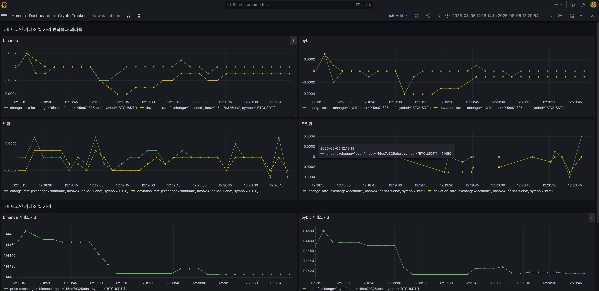
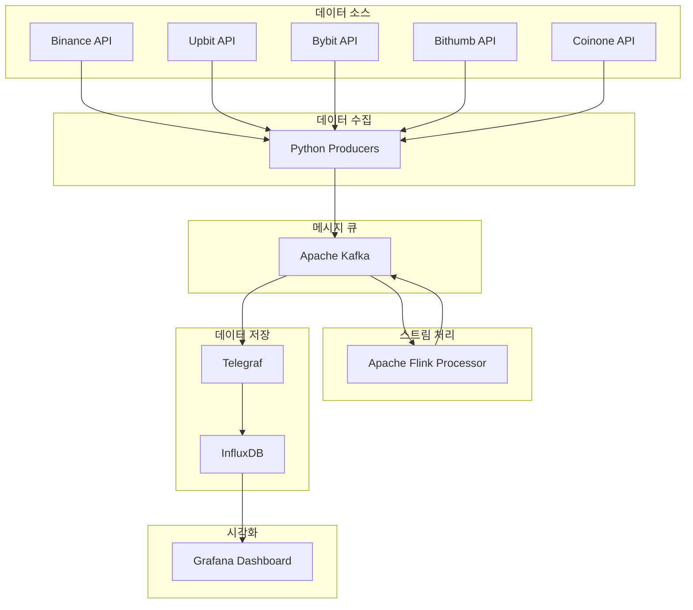

<div align="center">

# 🚀 Real-Time Crypto Asset Tracker

> **실시간 암호화폐 데이터 수집, 분석 및 시각화 시스템**  
> 5개 주요 거래소에서 실시간 데이터를 수집하여 변동률과 괴리율을 분석하고 대시보드로 시각화합니다.

</div>

</div>


<div align="center">
    

<p><em>실시간 암호화폐 데이터 대시보드 - 가격, 변동률, 괴리율을 실시간으로 모니터링</em></p>

</div>


[](https://python.org)
[](https://kafka.apache.org)
[](https://flink.apache.org)
[](https://influxdata.com)
[](https://grafana.com)
[](https://docker.com)
[](https://opensource.org/licenses/MIT)

---

## 📋 목차

1. [프로젝트 개요](#-프로젝트-개요)
2. [아키텍처](#-아키텍처)
3. [주요 기능](#-주요-기능)
4. [기술 스택](#-기술-스택)
5. [설치 및 실행](#-설치-및-실행)
6. [사용법](#-사용법)
7. [프로젝트 구조](#-프로젝트-구조)
8. [개발 가이드](#-개발-가이드)
9. [문제 해결](#-문제-해결)
10. [기여하기](#-기여하기)
11. [라이센스](#-라이센스)

---

## 🎯 프로젝트 개요

**Real-Time Crypto Asset Tracker**는 여러 암호화폐 거래소에서 실시간으로 데이터를 수집하고, 스트림 처리를 통해 가격 변동률과 거래소 간 괴리율을 계산하여 시각화하는 시스템입니다.


### 🎨 주요 특징

- 🔄 **실시간 데이터 수집**: 5개 주요 거래소 (Binance, Upbit, Bybit, Bithumb, Coinone)
- ⚡ **스트림 처리**: Apache Flink를 활용한 실시간 변동률 및 괄리율 계산
- 📊 **시계열 분석**: EMA(지수이동평균) 기반 괴리율 분석
- 🖥️ **실시간 대시보드**: Grafana를 통한 인터랙티브 시각화
- 🐳 **완전한 컨테이너화**: Docker Compose로 원클릭 배포

---

## 🏗️ 아키텍처




### 🔄 데이터 플로우

1. **데이터 수집**: Python Producers가 스레드를 이용해 비동적으로 5개 거래소 API에서 실시간 가격 데이터 수집
2. **메시지 전송**: 각 거래소별 Kafka 토픽으로 데이터 스트리밍
3. **스트림 처리**: Apache Flink가 실시간으로 변동률과 괴리율 계산
4. **결과 전송**: 처리된 데이터를 `crypto-ticker-volatility` 토픽으로 전송
5. **메트릭 수집**: Telegraf가 Kafka에서 데이터를 읽어 InfluxDB에 저장
6. **시각화**: Grafana가 InfluxDB에서 데이터를 읽어 실시간 대시보드 제공

---

## ✨ 주요 기능


### 📈 실시간 데이터 분석

- **가격 변동률**: 시간별 가격 변화율 계산
  
  ```
  변동률 = (현재가격 - 직전가격) / 직전가격 × 100%
  ```
  
  **수식**: `변동률 = (Pt - Pt-1) / Pt-1`
  - `Pt`: 현재 가격
  - `Pt-1`: 직전 가격

- **EMA 기반 괴리율**: 지수이동평균 대비 현재가 괴리율 분석
  
  ```
  괴리율 = (현재가격 - EMA) / EMA × 100%
  EMA = 현재가격 × α + 직전EMA × (1-α)
  ```
  
  **수식**: 
  - `괴리율 = (Pt - EMAt) / EMAt`
  - `EMAt = Pt × α + EMAt-1 × (1-α)`
  
  **변수 설명**:
  - `Pt`: 현재 가격
  - `EMAt`: 현재 시점의 지수이동평균
  - `α`: 가중치 계수 (0.1, 최근 데이터에 더 높은 가중치)


### 📊 시각화 대시보드

- **실시간 차트**: 가격, 변동률, 괴리율 실시간 모니터링
- **거래소별 필터링**: 특정 거래소 데이터만 선별적 조회
- **다양한 시간대**: 1분, 5분, 1시간, 1일 단위 데이터 조회

---

## 🛠️ 기술 스택


### Backend & Processing

- **Python 3.9+**: 데이터 수집 및 전처리
- **Apache Flink 1.20**: 대규모 스트림 처리
- **Apache Kafka 2.8**: 고성능 메시지 스트리밍


### Data Storage & Visualization  

- **InfluxDB 2.7**: 시계열 데이터베이스
- **Telegraf 1.28**: 메트릭 수집 에이전트
- **Grafana 10.2**: 데이터 시각화 및 대시보드


### Infrastructure

- **Docker & Docker Compose**: 컨테이너 오케스트레이션
- **Zookeeper**: Kafka 클러스터 코디네이션

---

## 🚀 설치 및 실행


### 📋 요구사항

- **Docker 20.10+**
- **Docker Compose 2.0+**  
- **최소 8GB RAM** (권장: 16GB)
- **최소 10GB 디스크 공간**


### ⚡ 빠른 시작

1. **저장소 클론**
   ```bash
   git clone https://github.com/your-username/real-time-asset-tracker.git
   cd real-time-asset-tracker
   ```

2. **스크립트 실행 권한 부여**
   ```bash
   chmod +x scripts/*.sh
   ```

3. **시스템 시작**
   ```bash
   ./scripts/start.sh
   ```

4. **대시보드 접속**  
   - Grafana: http://localhost:3000 (admin/admin)
   - InfluxDB: http://localhost:8086 (admin/adminpassword)

5. **시스템 종료**
   ```bash
   ./scripts/stop.sh
   ```


### 🔧 수동 실행

```bash
# 1. 모든 서비스 시작
docker-compose up -d

# 2. 서비스 초기화 대기
sleep 30

# 3. Kafka 토픽 생성
./scripts/create-topics.sh

# 4. 서비스 상태 확인
docker-compose ps
```

---

## 📖 사용법


### 🖥️ Grafana 대시보드

1. **로그인**: http://localhost:3000 (admin/admin)
2. **대시보드 이동**: Dashboards → Browse → Crypto Tracker 폴더
3. **데이터 조회**: 
   - 거래소별 필터링
   - 시간 범위 선택
   - 실시간 업데이트 확인


### 📊 주요 메트릭

- **Price**: 현재 거래 가격
- **Change Rate**: 이전 대비 변동률 (%)  
- **EMA Price**: 지수이동평균 가격
- **Deviation Rate**: EMA 대비 괴리율 (%)


### 🔧 관리 명령어

```bash
# 서비스 상태 확인
docker-compose ps

# 로그 확인
docker-compose logs -f producers
docker-compose logs -f processor

# 서비스 재시작
docker-compose restart producers

# 시스템 종료
./scripts/stop.sh
```

---

## 📁 프로젝트 구조

```
real-time-asset-tracker/
├── 📁 apps/
│   ├── 📁 producers/           # 데이터 수집기
│   │   ├── main.py            # 메인 실행 파일
│   │   └── collectors/        # 거래소별 수집기
│   └── 📁 processor/          # 스트림 처리기
│       └── calculrator_non_trivial.py
├── 📁 configs/                # 설정 파일
│   ├── config-docker.yaml     # Docker 환경 설정
│   ├── 📁 telegraf/           # Telegraf 설정
│   └── 📁 grafana/            # Grafana 설정
│       ├── 📁 provisioning/   # 자동 프로비저닝
│       └── 📁 dashboards/     # 대시보드 JSON
├── 📁 docker/                 # Docker 파일
│   ├── Dockerfile.producers
│   └── Dockerfile.processor
├── 📁 jars/                   # Flink JAR 파일
├── 📁 scripts/                # 운영 스크립트
│   ├── start.sh              # 시스템 시작
│   ├── stop.sh               # 시스템 종료
│   └── create-topics.sh      # 토픽 생성
├── docker-compose.yml         # 서비스 오케스트레이션
├── requirements-*.txt         # Python 의존성
└── README.md                 # 프로젝트 문서
```

---

## 👨‍💻 개발 가이드


### 🔧 개발 환경 설정

1. **Python 가상환경 생성**
   ```bash
   python -m venv venv
   source venv/bin/activate  # Linux/Mac
   # venv\Scripts\activate  # Windows
   ```

2. **의존성 설치**
   ```bash
   pip install -r requirements-producers.txt
   pip install -r requirements-processor.txt
   ```

3. **로컬 테스트**
   ```bash
   # Producers 로컬 실행
   cd apps/producers
   python main.py
   
   # Processor 로컬 실행  
   cd apps/processor
   python calculrator_non_trivial.py
   ```


### 🔄 코드 수정 후 재배포

```bash
# 특정 서비스 재빌드
docker-compose up --build -d producers
docker-compose up --build -d processor

# 또는 편리한 재시작 스크립트 사용
./scripts/restart.sh producers --build
```


### 📝 새로운 거래소 추가

1. `apps/producers/collectors/` 에 새 수집기 클래스 생성
2. `configs/config-docker.yaml` 에 거래소 설정 추가
3. Kafka 토픽 이름 업데이트
4. Processor에서 새 토픽 구독 설정

---

## 📋 디버깅 명령어

```bash
# 전체 시스템 상태
docker-compose ps

# 서비스별 로그 확인
docker-compose logs -f producers
docker-compose logs -f processor
docker-compose logs -f telegraf

# Kafka 상태 확인
docker-compose exec kafka kafka-topics --bootstrap-server localhost:9092 --list
docker-compose exec kafka kafka-console-consumer --bootstrap-server localhost:9092 --topic crypto-ticker-volatility --from-beginning --max-messages 5

# InfluxDB 데이터 확인
docker-compose exec influxdb influx query --token "my-super-secret-crypto-tracker-token-12345" --org "crypto-tracker" 'from(bucket:"crypto-metrics") |> range(start:-1h) |> limit(n:10)'
```

---

## 🤝 기여하기

이 프로젝트에 기여해주셔서 감사합니다! 


### 📝 기여 방법

1. **Fork** 저장소
2. **Feature 브랜치** 생성 (`git checkout -b feature/amazing-feature`)
3. **변경사항 커밋** (`git commit -m 'Add amazing feature'`)
4. **브랜치 Push** (`git push origin feature/amazing-feature`)
5. **Pull Request** 생성


### 🏷️ 이슈 리포팅

- **버그 리포트**: 재현 가능한 단계와 환경 정보 포함
- **기능 요청**: 구체적인 사용 사례와 기대 효과 설명
- **질문**: 명확하고 구체적인 질문으로 작성

---

## 📄 라이센스

이 프로젝트는 **MIT 라이센스** 하에 배포됩니다. 자세한 내용은 [LICENSE](LICENSE) 파일을 참조하세요.

```
MIT License

Copyright (c) 2025 Real-Time Crypto Asset Tracker

Permission is hereby granted, free of charge, to any person obtaining a copy
of this software and associated documentation files (the "Software"), to deal
in the Software without restriction, including without limitation the rights
to use, copy, modify, merge, publish, distribute, sublicense, and/or sell
copies of the Software, and to permit persons to whom the Software is
furnished to do so, subject to the following conditions:

The above copyright notice and this permission notice shall be included in all
copies or substantial portions of the Software.

THE SOFTWARE IS PROVIDED "AS IS", WITHOUT WARRANTY OF ANY KIND, EXPRESS OR
IMPLIED, INCLUDING BUT NOT LIMITED TO THE WARRANTIES OF MERCHANTABILITY,
FITNESS FOR A PARTICULAR PURPOSE AND NONINFRINGEMENT. IN NO EVENT SHALL THE
AUTHORS OR COPYRIGHT HOLDERS BE LIABLE FOR ANY CLAIM, DAMAGES OR OTHER
LIABILITY, WHETHER IN AN ACTION OF CONTRACT, TORT OR OTHERWISE, ARISING FROM,
OUT OF OR IN CONNECTION WITH THE SOFTWARE OR THE USE OR OTHER DEALINGS IN THE
SOFTWARE.
```

---
